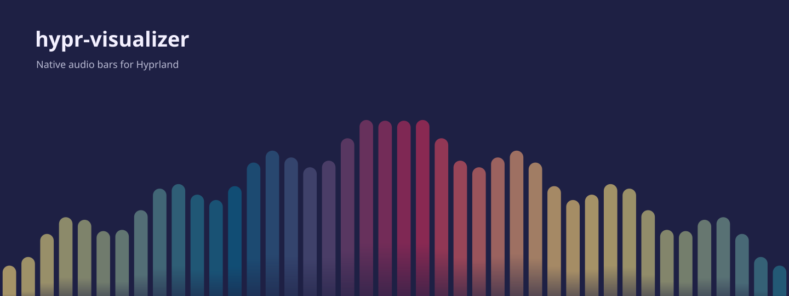

# hypr-visualizer

A small native audio visualizer for **Hyprland**. Rounded pastel bars react to your music across every monitor, with bass in the center, mirrored motion, and a soft fade into your wallpaper.



*Illustrative preview. The app draws only the bars; your wallpaper stays in place. Actual heights follow your audio.*

## Find things quickly

| Need | File or command |
| --- | --- |
| Install or update | [`install.sh`](install.sh) · `./install.sh` |
| Open live settings | `~/.local/bin/hypr-visualizer-settings` |
| Change Classic defaults | [`theme.h`](theme.h) |
| Runtime settings format | [`config.h`](config.h) · `~/.config/hypr-visualizer/config` |
| Desktop renderer and audio | [`main.c`](main.c) |
| DMS lockscreen view | [`lockscreen/Bars.qml`](lockscreen/Bars.qml) |
| App icon | [`assets/hypr-visualizer.svg`](assets/hypr-visualizer.svg) |
| Run all checks | `make test && python3 tests/settings.py && python3 tests/install.py` |
| Remove installation | `~/.local/share/hypr-visualizer/uninstall.sh` |

The sections below follow this order: **Install → Lock screen → Appearance → Update → Troubleshooting → Development**.

- **Classic theme preserved by default.** Optional GTK settings window and live config reload; no rebuilding.
- **Bass-reactive glow**, Classic/Aurora/Sunset/Ocean palettes, custom gradients and colors extracted from a chosen wallpaper image.
- **Bars, wave, thin lines and rounded pill styles**, with optional natural motion that lifts quiet details and softens loud peaks.
- **All monitors**, including monitors connected after startup.
- **Screen-adaptive bars** (about 64 at 1920 logical pixels), smooth attack and release, 60% opacity, and a fading base.
- **Output audio only**, including PipeWire-Pulse and Bluetooth; follows the default output.
- **Click-through desktop layer.** Windows stay above the bars.
- **Native C + Wayland + Cairo.** No browser, GTK, Qt, or CAVA needed for the desktop app.
- **Optional DMS lockscreen integration**, using the same theme and audio analysis.

## Quick install

Run inside your Hyprland session as your normal user. You need `curl` and `tar` first.

```sh
curl -fsSL https://raw.githubusercontent.com/mir4zul/hypr-visualizer/main/quick-install.sh | sh
```

The script installs missing build dependencies on **Arch-based** or **Debian/Ubuntu-based** systems using `sudo`, downloads the source, builds locally, installs into `~/.local/bin`, adds autostart, and starts the visualizer. Hyprland itself and a working audio server must already be installed. Other distributions can use the manual instructions below.

To download and inspect the script before running it:

```sh
curl -fsSLO https://raw.githubusercontent.com/mir4zul/hypr-visualizer/main/quick-install.sh
less quick-install.sh
sh quick-install.sh
```

## Manual install

Install build dependencies for your distribution.

**Arch Linux / EndeavourOS / Manjaro**

```sh
sudo pacman -S --needed base-devel git pkgconf wayland wayland-protocols cairo libpulse python
```

**Debian / Ubuntu** — in an existing Hyprland environment:

```sh
sudo apt-get update
sudo apt-get install -y git build-essential pkg-config libwayland-dev wayland-protocols libcairo2-dev libpulse-dev python3
```

Then clone and install:

```sh
git clone https://github.com/mir4zul/hypr-visualizer.git
cd hypr-visualizer
./install.sh
```

On other distributions, install a C compiler, Make, pkg-config, wayland-scanner, Wayland headers/protocols, Cairo headers, and libpulse headers. Python 3 is used for DMS integration and uninstalling.

### Build only

```sh
make
make test
./build/hypr-visualizer
```

`make install PREFIX="$HOME/.local"` installs the binary and settings script. It does not add autostart or lockscreen integration. Run the binary inside Hyprland.

## What the installer changes

- Installs `~/.local/bin/hypr-visualizer`, `hypr-visualizer-settings`, a settings launcher and an uninstall script.
- Backs up your Hyprland config before adding one autostart line.
- Supports `hyprland.lua` and `hyprland.conf` in `$XDG_CONFIG_HOME/hypr` (default `~/.config/hypr`). Lua takes priority if both exist. Custom config locations need manual autostart setup.
- Starts immediately in an active Hyprland session. Uses a transient systemd user service when available; otherwise launches a background process.
- Reinstalling updates the binary without duplicating autostart.
- Adds DMS lockscreen bars if a compatible local DMS source config is found.

Skip optional lockscreen integration or immediate startup:

```sh
./install.sh --no-lockscreen
./install.sh --no-start
```

## Lockscreen

The integration supports **DankMaterialShell (DMS)** with its source config at `~/.config/quickshell/dms`. The installer backs up `Modules/Lock/LockScreenContent.qml`, adds a visualizer loader behind the controls, and installs the QML components in your XDG data directory.

Lockscreen views share one additional audio-only helper while visible. Silence makes the bars disappear. A powered-off monitor cannot display the visualizer. Other screen lockers are not supported by this integration.

DMS updates may replace the patched lockscreen file. Re-run `./install.sh` afterward. If DMS disables hot reload, reload DMS while your session is unlocked. An incompatible DMS layout is skipped without preventing desktop installation.

## Appearance and live settings

The default **Classic** preset preserves the previous palette, bars, opacity and motion, with glow off. Open **Visualizer Settings** from your app launcher or run:

```sh
~/.local/bin/hypr-visualizer-settings
```

Choose a palette (Classic, Aurora, Sunset, Ocean), edit a custom comma-separated hex gradient, or choose a wallpaper image to extract its dominant colors. Wallpaper colors are a saved snapshot of the image you select; changing your desktop wallpaper does not automatically re-extract them. A shared palette is used across monitors.

The settings window controls bar width and gap in logical pixels, height, opacity, bass glow, rise/fall timing, **Bars / Wave / Lines / Pill** styles, **Classic / Natural** movement, and whether the visualizer appears on the **lockscreen**. Natural movement lifts quiet details, compresses loud peaks and slows abrupt changes while keeping silence invisible. Wave and Lines use a thin 3-pixel stroke; width and gap still control their sample spacing. Changes save automatically and update both desktop and lockscreen, usually within about 100 milliseconds; there is no Apply button. **Restore Classic** restores the complete original look, including disabling glow.

The optional settings window needs **GTK 4 + PyGObject**; wallpaper extraction also needs **Pillow**. On Arch these packages are `gtk4 python-gobject python-pillow`; on Debian/Ubuntu they are `gir1.2-gtk-4.0 python3-gi python3-pil`. The desktop renderer remains native C + Wayland + Cairo and can use runtime configuration without GTK.

CLI examples:

```sh
hypr-visualizer-settings --set theme=aurora --set glow=0.6 --set motion=natural
hypr-visualizer-settings --set style=wave --set opacity=0.7
hypr-visualizer-settings --set theme=custom --set 'colors=#74c0fc,#b197fc,#f783ac'
hypr-visualizer-settings --wallpaper '/path/to/wallpaper.jpg'
hypr-visualizer-settings --classic
hypr-visualizer-settings --show
```

Settings are stored at `${XDG_CONFIG_HOME:-~/.config}/hypr-visualizer/config`:

```ini
theme=classic
style=bars
motion=classic
bar_width=21.6
gap=8.4
height=0.48
opacity=0.6
glow=0
attack=0.055
release=0.24
```

Optional `colors=#rrggbb,#rrggbb,...` overrides the palette; put it after `theme`. Values are validated and invalid files leave the last valid settings active. Deleting the config returns to Classic. The settings app saves atomically and preserves settings across reinstallations. There are at most 512 visible bars per monitor; the shared audio analyzer retains 42 bands, interpolated across the visible bars. Scaling uses logical screen size.

[`theme.h`](theme.h) still contains compiled Classic defaults, analysis gains, base fade and the 30 FPS target for source-level customization.

## Update and uninstall

For a cloned checkout:

```sh
git pull --ff-only
./install.sh
```

Or rerun the quick installer. Commit or save your `theme.h` edits before updating; the quick installer uses the default upstream theme.

Uninstall:

```sh
sh "${XDG_DATA_HOME:-$HOME/.local/share}/hypr-visualizer/uninstall.sh"
```

The uninstaller stops the app, removes its autostart and DMS loader, and deletes installed app files. Saved visualizer settings, config backups and logs remain available. Your source checkout is kept.

## Troubleshooting and limitations

- **Nothing visible:** play audio and expose the desktop. Bars are behind application windows and fade away during silence.
- **No audio response:** check that playback uses your default output and PipeWire-Pulse or PulseAudio is running.
- **Logs:** `${XDG_STATE_HOME:-$HOME/.local/state}/hypr-visualizer/visualizer.log`.
- **Stop:** `systemctl --user stop hypr-visualizer.service` for the installer-started service, or `pkill -x hypr-visualizer` for a direct launch.
- Tested on an Arch Linux Hyprland session with two 1080p monitors and Bluetooth audio. Other distro install paths are provided but have not all been tested on a desktop.
- Two shared-memory pixel buffers are used per monitor; rendering cost grows with resolution. Fractional scaling currently uses compositor scaling.
- The spectrum uses Hann-windowed Goertzel measurements with visual weighting. It is decorative, not a calibrated audio analyzer or the CAVA engine.

## Development

```sh
make
make test
python3 tests/install.py
python3 tests/settings.py
```

Tests cover silence, tones, attack/release, mirrored frequency placement, adaptive density, Classic defaults, config validation, all four render styles, glow, live reload, wallpaper extraction, and isolated install/update/uninstall cycles for both config formats. The settings test needs Pillow. Installer tests use temporary homes and do not change your live session.

## License

[MIT](LICENSE). The vendored [wlr-layer-shell protocol](https://gitlab.freedesktop.org/wlroots/wlr-protocols) retains its upstream license.
